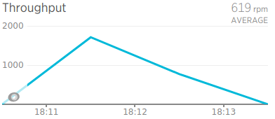
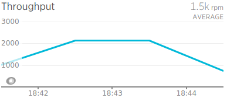
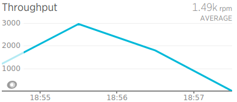
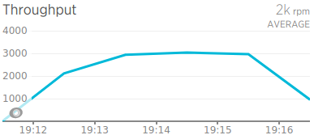

# Etapa 2

## Tests de performance

#### Test 1
500 Usuarios, 60 segs rampup

Servicio | cpu_quota | cpu_set | mem_*
---------|-----------|---------|-----
web | 1000000 | 0 | 512m
mongo | 750000 | 1 | 512m
redis | 250000 | 1 | 512m

**RESULTADO:** La aplicación no soporta la carga, crashea antes de finalizar el test

_____________________
#### Test 2
500 Usuarios, 60 segs rampup

Servicio | cpu_quota | cpu_set | mem_*
---------|-----------|---------|-----
web | _750000_ | 0 | _1024m_
mongo | 750000 | 1 | 512m
redis | 250000 | 1 | _256m_

**RESULTADO:** 48.3 req/s - Avg: 48 Min: 6 Max: 399 Err: 0%

_____________________
#### Test 3
1000 Usuarios, 100 segs rampup

Servicio | cpu_quota | cpu_set | mem_*
---------|-----------|---------|-----
web | 750000 | 0 | 1024m
mongo | 750000 | 1 | 512m
redis | 250000 | 1 | 256m

**RESULTADO:** La aplicación no soporta la carga

_____________________
#### Test 4
1000 Usuarios, 100 segs rampup

Servicio | cpu_quota | cpu_set | mem_*
---------|-----------|---------|-----
web | _1000000_ | 0 | _1536m_
mongo | 750000 | 1 | _768m_
redis | 250000 | 1 | _512m_

**RESULTADO:** 58.6 req/s - Avg: 107 Min: 5 Max: 2719 Err: 0

