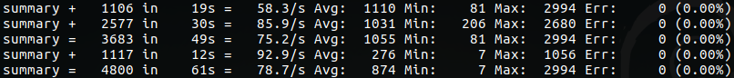
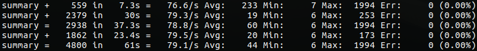

# Etapa 3

## HA
Configuración en `docker-compose-haproxy.yml`. Se agregó un servicio `haproxy` que utiliza la imagen [dockercloud/haproxy](https://github.com/docker/dockercloud-haproxy). Automaticamente detecta cuando se escalan instancias de `web` y se configuran en el haproxy.

## Ejecución

1. Levantar la aplicación (con la base de datos y redis)
``` bash
docker-compose -f docker-compose-haproxy.yml up web
```

2. Iniciar haproxy:
``` bash
docker-compose -f docker-compose-haproxy.yml up haproxy
```
Automáticamente se registra la instancia de web y se puede navegar la apliación en http://localhost:8080

3. Escalar varias instancias:
``` bash
docker-compose -f docker-compose-haproxy.yml scale web=3
```
Se puede ver en el output del haproxy como se registran las nuevas instancias

## Tests performance

``` bash
docker-compose -f docker-compose-haproxy.yml up jmeter
```

- 800 usuarios, 60 s rampup, 1 instancia:


- 800 usuarios, 60 s rampup, 3 instancias:

